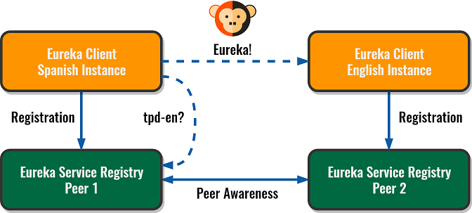

# Service Discovery with Spring Boot 2 and Spring Cloud Eureka

## Introduction

This source code includes two projects with proper configuration to execute:

* Two Eureka Service Registry instances with the Peer Awareness feature enabled.
* Two Eureka Clients that register themselves and see each other thanks to the replica mode of the servers.

If you want to read the complete guide, it's available for free at The Practical Developer site: 

[Spring Boot Service Discovery with Eureka Peer Awareness](https://thepracticaldeveloper.com/2018/03/18/spring-boot-service-discovery-eureka/)

## Simplified Logical View

